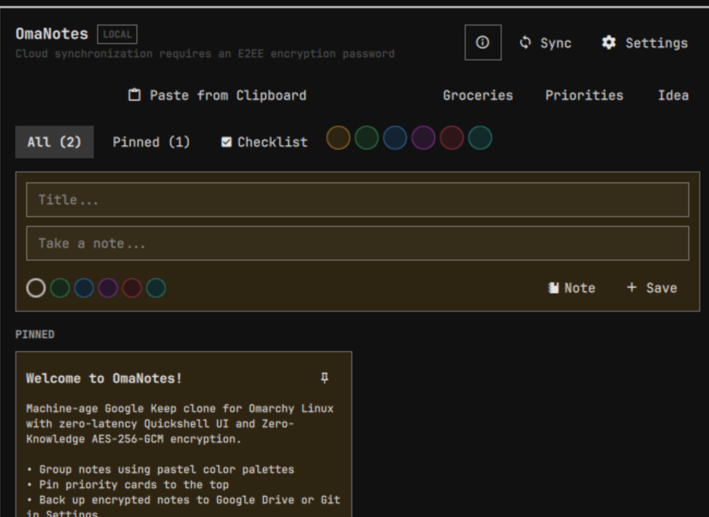

# OmaNotes - Omarchy Linux İçin Sıfır Bilgili E2EE ve Bulut Senkronizasyonlu Not ve Görev Yöneticisi

[](https://github.com/ozdil)
[](https://buymeacoffee.com/ozdil)



Omarchy Linux için yerel Quickshell arayüzü ve sertleştirilmiş Rust motoru ile geliştirilmiş, AES-256-GCM uçtan uca şifreli (E2EE) ve Google Drive/Git bulut senkronizasyonlu not defteri ve yapılacaklar listesi uygulaması.

Geliştirici: Ozan Özdil (ozdil)  
Lisans: MIT  
Eklenti Kimliği: ozdil.omanotes  

---

## Öne Çıkan Yetenekler

- Google Keep Tarzı Renk Kartları: Notları pastel renk temalarıyla (Sarı, Yeşil, Mavi, Mor, Kırmızı, Teal) görsel olarak gruplama.
- Etkileşimli Kontrol Listeleri (Yapılacaklar / To-Do): Üstü çizili yerel onay kutuları, anında tamamlama ve tamamlananları tek tıkla temizleme.
- Fare ve Dokunmatik Odaklı Ergonomi:
  - Tek tıkla Pano Yapıştırma (`wl-paste`): Yazmaya gerek kalmadan panodaki içeriği anında nota dönüştürme.
  - Hızlı şablon butonları: Market Alışverişi, Öncelikler, Fikir.
  - Renk ve durum filtre çipleri (Tümü, İğnelenenler, Kontrol Listeleri, Renk filtreleri).
  - Her kart üzerinde hızlı aksiyon barı: İğnele, Kopyala/Çoğalt, Sil ve yerleşik renk paleti.
- Sıfır Bilgili Uçtan Uca Şifreleme (E2EE):
  - Tüm notlar cihazdan ayrılmadan önce Argon2id v2 KDF, 16-bayt rastgele tuz (salt), 12-bayt benzersiz sayaç (nonce) ve AES-256-GCM ile şifrelenir.
  - Bulut deposunda veya yedeklerde asla açık metin (plaintext) sızıntısı gerçekleşmez.
- Çoklu Bulut Senkronizasyonu:
  - Google Drive, Nextcloud, WebDAV: `rclone` aracılığıyla sorunsuz şifreli senkronizasyon.
  - Git Kasası (Git Vault): Özel Git deposuna şifreli `notes.enc` anlık görüntülerini (`commit` ve `push`) aktarma.
  - Felaket Kurtarma: Yeni kurulan bir sistemde tek tıkla buluttan çekme ve şifre çözme (`--pull`).

---

## Gereksinimler

- cargo ve rustc (Rust derleme zinciri)
- quickshell (Arayüz kabuğu)
- wl-clipboard (Wayland pano entegrasyonu için)
- rclone (Opsiyonel: Google Drive / WebDAV senkronizasyonu için)
- git (Opsiyonel: Şifreli Git kasası senkronizasyonu için)

---

## Kurulum ve Kaldırma

```bash
# Eklenti dizinine gidin
cd ~/.config/omarchy/plugins/ozdil.omanotes

# Motoru derleyin ve kullanıcı alanına kurun
./build.sh

# Kaldırmak istediğinizde
./uninstall.sh
```

---

## Doğrulama ve Testler

```bash
# Birim, güvenlik ve kaos testlerini çalıştırın
cargo test

# Omarchy eklenti doğrulamasını çalıştırın
omarchy plugin validate .
```
